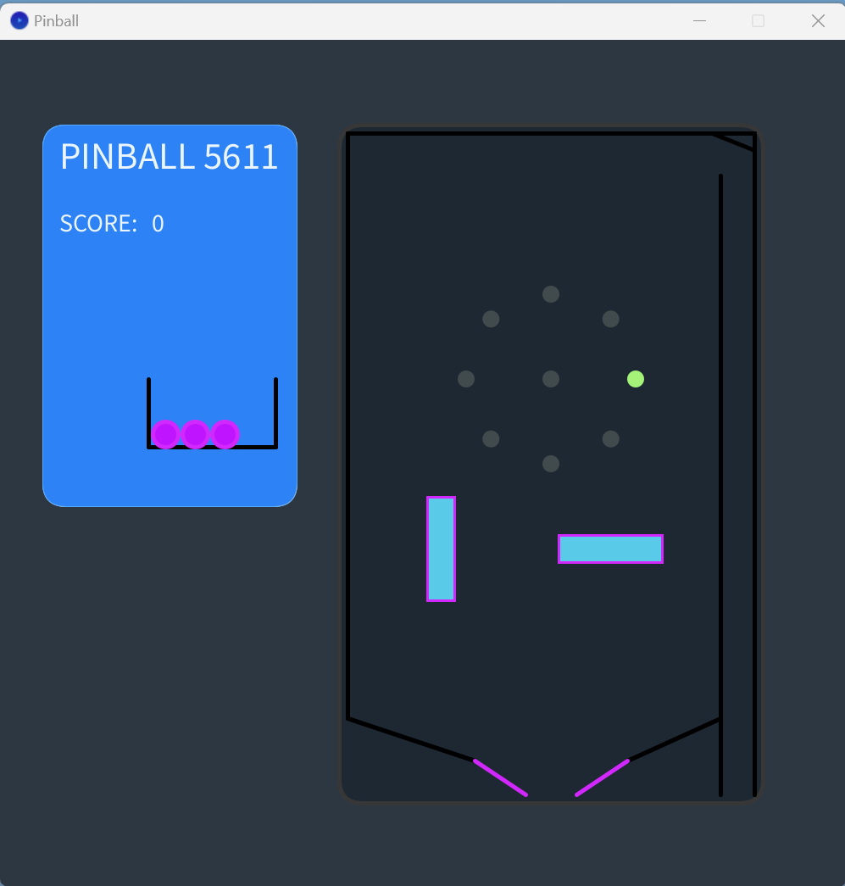

# Pinball Game

## Description

Welcome to the Pinball Game developed using Processing. This game replicates the physics and visuals of a classic pinball machine, with interactive flippers, bouncy balls, and various obstacles including circles, lines, and boxes. The objective is to score points by hitting obstacles and keep the ball in play using the flippers.

## Features

1. **Balls**: You can launch balls into the playing area, and the balls interact with different elements within the board.
2. **Flippers**: Two interactive flippers at the bottom that can be controlled using arrow keys.
3. **Obstacles**:
   - **Circles**: Randomly placed circles that the balls can hit.
   - **Lines**: Static lines that can redirect the ball.
   - **Boxes**: Box obstacles that the ball can bounce off.
4. **Sound Effects**: Engaging sounds that play when the ball hits an objective.
5. **Scoring**: Points are accumulated when the ball hits an objective. Score more by hitting the primary objective multiple times in succession.

## How to Play

- **Launch a Ball**: Press the `UP` arrow key.
- **Control the Left Flipper**: Press the `LEFT` arrow key.
- **Control the Right Flipper**: Press the `RIGHT` arrow key.
- **Reset the Game**: Press `r`.

## Installation

1. Ensure you have the Processing environment set up on your machine.
2. Clone/download the repository.
3. Make sure you place all the sound files in the "sounds" folder.
4. Open the main `.pde` file using Processing and run the sketch.

## Customization

- **Coefficient of Restitution**: You can adjust the `cor` value to modify the ball's bounciness.
- **Modify the Game Objects**: Adjust the arrays `CircleShapes`, `LineShapes`, and `BoxShapes` to customize the game's obstacles.
- **Volume Control**: Adjust the volume by modifying the `volumeControl` object.
